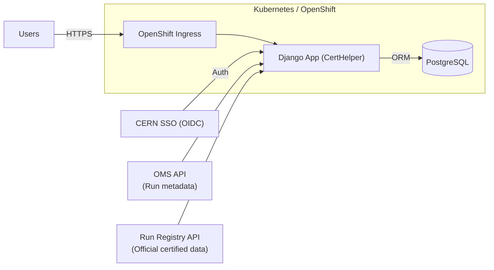

+++
title = "Ensuring Quality in CMS Tracker Data"
author = "Abhit"
date = 2022-01-22
tags = ["cern", "monitoring", "web-app"]
categories = ["projects", "CERN"]
+++

Every second, the CMS tracker detector records millions of particle trajectories. But without careful quality checks, this flood of data risks being unusable for physics discoveries. To guard against this, CMS relies on a dedicated Data Quality Monitoring (DQM) system. The tracker, functioning like a giant digital camera, captures the paths of charged particles produced during collisions. Because it generates such an enormous volume of data, ensuring quality is essential for 
reliable physics analyses.

<!--more--> 
## Certifying the Data

The DQM software processes raw detector output and produces simplified summaries, known as monitor elements. These include histograms of sensor signals, basic statistics on detector performance, and plots that highlight irregular or unexpected behavior. Physicists examine these summaries through a web interface called the DQMGUI, where the monitoring team decides whether a dataset is suitable for physics analysis. Their decisions are then recorded in the Run Registry, the official database of certified data. In this process, data certification acts as a quality assurance stamp, ensuring that only trustworthy datasets are released for physics studies.

While the DQM system generates automated summaries, the final step of certification remains a human-driven process organized in shifts. Operators, or shifters, are on duty during data taking. They monitor the tracker in real time, follow detailed checklists, and confirm the detector's status. Their work is then reviewed by experienced supervisors (shift leaders), who validate certifications, ensure consistency, and prepare official summary reports.

## Streamlining Certification

To make this process more efficient, I helped develop the CertHelper web application. The tool streamlines certification by guiding operators through structured forms, with many fields automatically filled from other CMS services. This reduces manual entry and minimizes the risk of errors.

CertHelper also enforces checklists to ensure that no critical step is overlooked and stores all certifications in a centralized database. Supervisors can review or edit entries and designate certain runs as reference runs, which then serve as trusted baselines for future comparisons.

Beyond data entry and validation, the application provides visualization and reporting features. It generates maps and plots that illustrate detector health and automatically produces daily and weekly reports, giving the monitoring team a clear and consistent view of performance over time.

  
   
  <em>Daily shift report generated automatically by CertHelper</em>

## Impact

Before CertHelper, certification was manual and error-prone, with operators copying information between systems and supervisors tied up in routine checks. With CertHelper, much of this work is automated. The tool saves time, enforces consistency across shifts, and builds confidence in the results, ensuring that the discoveries made at CMS are based on data that is both reliable and of high quality. 

---

## Architecture
 
The CertHelper architecture integrates web, database, and deployment layers with CERN's authentication and external APIs. The diagram below illustrates the connections between users, services, and data sources within the system.

1. **Web Framework**  
   - **Technology:** Django (Python web framework).  
   - **Role:** Provides models to represent certified runs and users, forms for the certification process, and an admin interface for supervisors to manage checklists and roles.  
   - **Why Django?** Mature, well-supported, and integrates smoothly with CERN’s authentication system.  
2. **Database**  
   - **Technology:** PostgreSQL (relational database).  
   - **Role:** Stores certifications, user information, checklists, and reports in a reliable and queryable way.  
   - **Why PostgreSQL?** Robust, scalable, and fits well with CERN’s infrastructure.  
3. **Deployment Platform**  
   - **Technology:** OpenShift (Kubernetes at CERN).  
   - **Role:** Runs the application in containers, ensures scalability and high availability, and manages secrets and configuration securely.  
4. **Integrations**  
   - **Authentication:** CERN Single Sign-On (SSO), mapping roles like operator, shift leader, and admin.  
   - **External APIs:**  
     - **OMS (Online Monitoring System):** Supplies run metadata and helps auto-fill certification forms.  
     - **Run Registry:** The official database of certified data, used for cross-checks.  
