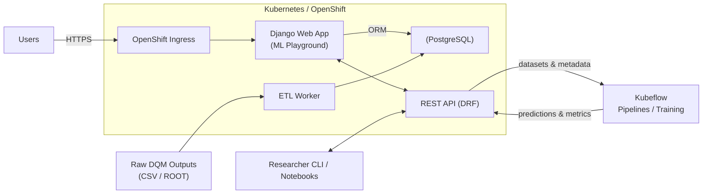

+++
title = "Building a Machine Learning Playground"
author = "Abhit"
date = 2022-03-04
tags = ["cern", "machine-learning", "infrastructure"]
categories = ["projects", "CERN"]
+++

At CERN’s CMS experiment, data quality has traditionally been certified by human operators reviewing run after run. However, with the increasing volume of data, this manual process is becoming a bottleneck, paving the way for machine learning to take a more prominent role.

To ensure datasets are reliable for physics analyses, the CMS collaboration uses Data Quality Monitoring (DQM) software. This software analyzes raw detector output and generates concise summaries, known as monitor elements. These include histograms of sensor signals, basic statistics about detector performance, and plots that highlight unusual or unexpected behavior.

<!--more--> 
## Human Certification

Operators, known as shifters, along with more experienced shift leaders, review the DQM outputs through a web interface called the DQM GUI. Based on their observations, they decide whether a dataset is reliable enough for physics analysis. The outcome of this review is recorded in the Run Registry, the official database of certified data.

To support this work, we developed the Certification Helper web application. It streamlines the process by guiding shifters and shift leaders through structured checklists and forms to certify data at the run level, where a run can last anywhere from a few minutes to several hours.

#### Beyond Human Scale

However, over time, the community wanted to certify data at a much finer granularity: the lumisection level. A lumisection represents a 23-second block of data within a run, and since a single run can contain hundreds of lumisections, the number of items to be checked grew dramatically. At this scale, manual certification was no longer practical.

## Scaling with Machine Learning

This surge in data volume opened the door for Machine Learning (ML) models to support, and in some cases automate, key parts of the process. For example, recommendation models can analyze detector behavior to suggest candidate gold standard runs for supervisors to review and approve. Automatic flagging models can indicate whether a lumisection is good or bad, reducing the amount of manual inspection required.

Different groups within CMS benefit in complementary ways. Operators can focus their attention on data flagged as potentially problematic rather than scanning thousands of plots. Supervisors review model-suggested reference runs and confirm final certification results. Researchers and ML developers design and test new models on annotated data, benchmarking approaches to identify the most effective ones.

#### Fragmented Beginnings

Yet despite these advances, ML efforts for DQM remained fragmented. Researchers relied on arbitrary datasets. Baseline models were missing. Labeling criteria were inconsistent. And many models overlooked the fact that detector behavior changes over time.

## Organizing ML Efforts

To tackle the challenges of lumisection-level certification, I conceptualized the ML Playground and led its design and development. Conceived as a Kaggle-style platform but explicitly tailored for CMS data certification, it introduces structured datasets and tasks to ensure fair and consistent model evaluation.

- **Centralized datasets**: Curated collections of past runs and lumisections, already certified by humans, that serve as the "ground truth."  
- **Standardized tasks**: Predefined training and testing splits so that all models are evaluated consistently.  
- **Model submissions**: Researchers can upload predictions that are scored against the ground truth.  
- **APIs and CLI tools**: Programmatic access makes experiments reproducible and easy to integrate with external workflows.  
- **Visualization**: Histograms, statistics, and correlations can be explored through the web interface to gain a better understanding of both the data and model performance.  
  
By providing these shared resources and benchmarks, the ML Playground aims to transform a fragmented set of efforts into a coherent community platform. It has created a common ground where researchers could compare approaches fairly and successful models could be prepared for integration into operator workflows.

 
## Outlook

The ML Playground has brought order and consistency to DQM efforts by standardizing data access and evaluation, making results reproducible and directly comparable. As a core developer, I helped bridge the gap between end-user needs and technical implementation, laying the groundwork for structured machine learning efforts. Today, the platform supports reproducible research and provides a clear path for integrating successful models into operator workflows, making lumisection-level certification more efficient and opening the door to further automation at the CMS experiment.

---
## Architecture

The ML Playground is built on a modular architecture that combines a modern web framework, a relational database, programmatic interfaces, and a scalable deployment environment.  

1. **Web App (Django)**
   - Serves pages for browsing datasets, histograms, and model results.
   - Provides an admin UI for managing datasets, tasks, and submissions.
2. **Database (PostgreSQL)**
   - Stores runs, lumisections, histograms, tasks, and predictions.
   - Ensures data is consistent, queryable, and auditable.
3. **Interfaces for ML Work**
   - **REST API (DRF):** Programmatic access to datasets, tasks, and predictions.
   - **CLI Tools:**
     - **ETL:** Ingests raw DQM outputs (CSV/ROOT) into the database.
     - **Researcher CLI:** Download datasets, submit predictions, and query results.
4. **Deployment (OpenShift/Kubernetes)**
   - Containerized services (web/API/worker).
   - Scales, manages secrets/config, and keeps services highly available.
5. **ML Execution (Kubeflow)**
   - **Pipelines/Training:** Pull curated datasets via the REST API/CLI to run training/inference.
   - **Results Back:** Push model predictions and metrics back to the platform via the API for storage, scoring, and comparison.
