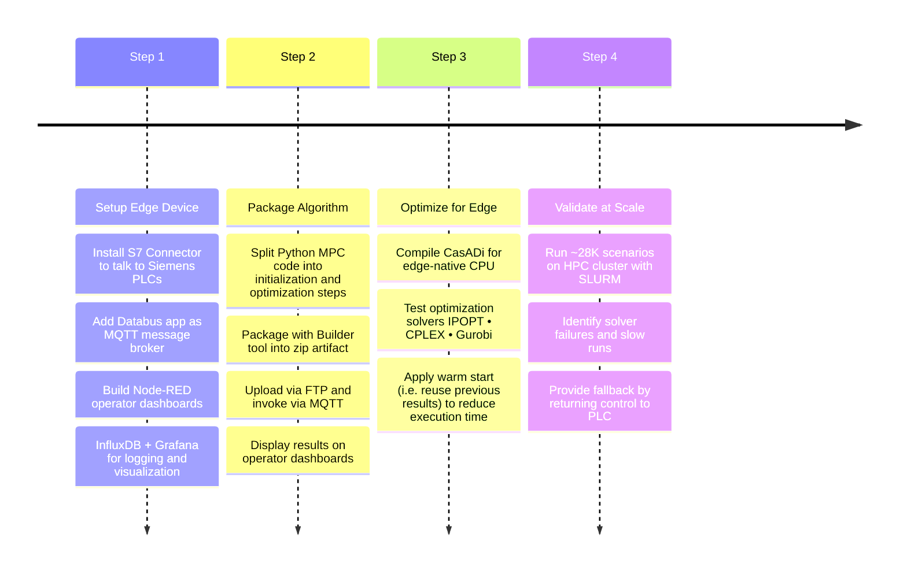

+++
title = "Advanced Control Algorithm on Edge"
author = "Abhit"
date = 2023-10-07
tags = ["cern", "control-system", "edge-computing"]
categories = ["projects", "CERN"]
+++

Large technical systems such as cooling plants, ventilation systems, and safety installations must operate continuously around the clock. These systems rely on [programmable logic controllers](https://en.wikipedia.org/wiki/Programmable_logic_controller) (PLCs), specialized industrial computers built to execute precise instructions reliably for years without interruption. Designed with safety and stability in mind, PLCs form the backbone of industrial automation. They manage essential functions, such as circulating cooling water for accelerators, adjusting ventilation fans to maintain safe conditions in underground tunnels, and activating interlocks to shut down equipment immediately if unsafe conditions are detected.

The logic inside a PLC is usually based on simple feedback rules. A typical example would be: “If the temperature rises above a threshold, increase the fan speed. If it falls too low, reduce the fan speed.” These rules, often implemented as [PID controllers](https://en.wikipedia.org/wiki/Proportional%E2%80%93integral%E2%80%93derivative_controller), are highly effective for straightforward, repetitive tasks. However, they struggle in more complex situations, for example, when multiple variables, such as temperature, humidity, and energy cost, interact. It also arises when future conditions must be anticipated or when competing objectives, such as comfort and energy efficiency, need to be balanced. These limitations underscore the need for more advanced control strategies.

## Advanced control method
One such approach is [Model Predictive Control](https://en.wikipedia.org/wiki/Model_predictive_control) (MPC). To handle complexity beyond simple rules, control engineers use MPC to:
- Build a mathematical model of the system, e.g., how the temperature will change if the fan speed is adjusted.
- Predict the system’s future behavior over the next minutes or hours.
- Select the optimal control actions that minimize costs, such as energy consumption, while still meeting safety margins or comfort requirements.

Compared to traditional methods, MPC is a leap forward in terms of efficiency and intelligence. For instance, a ventilation system managed with MPC can anticipate rising CO₂ levels and increase fan speed before a large group enters a hall, instead of waiting for sensors to trigger a response. This showcases the potential for significant optimization in industrial systems.

## Industrial Edge Computing
The main limitation is that MPC is computationally demanding, as solving optimization problems in real-time requires significantly more processing power than a PLC can provide. Industrial Edge Devices fill this gap. These small industrial PCs, installed close to the equipment and sharing the same network as the PLCs, offer significantly greater processing capacity. They can run advanced algorithms, such as MPC, while operating at the edge, close to the machines, which enables fast decisions without transmitting large volumes of raw data to remote servers. In this setup, PLCs continue to provide the dependable backbone for safety and routine control, while the Edge Devices handle the more complex and computationally intensive tasks, such as running the MPC algorithm.

To put MPC into action, we tested it on an Air Handling Unit within CERN’s HVAC system. The goal was to run and evaluate the algorithm developed by [F. Ghawash et al. (2023)](https://ieeexplore.ieee.org/document/9894128) on an [Industrial Edge Device](https://www.siemens.com/global/en/products/automation/topic-areas/industrial-edge/industrial-edge-devices.html), rather than on a powerful server. While effective in theory, the algorithm proved too resource-intensive to execute in real time on such limited hardware. The challenge, therefore, was to redesign the deployment and optimize performance so the MPC could operate reliably within the device’s constrained capacity. 

  

## Deployment
To run the MPC reliably on the edge, we followed a series of implementation steps. First, we prepared the Industrial Edge Device with the necessary apps to handle communication with PLCs, exchange messages internally, and provide operators with dashboards and visualization tools. This involved installing and configuring the necessary software components. Next, we packaged the MPC algorithm into a deployable application using a toolchain that turned the Python code into an app ready to run on the device. We then optimized the code for the device’s limited hardware, fine-tuning the optimization libraries and solvers until performance was fast enough for real-time use. This optimization process involved identifying and eliminating bottlenecks in the code. Finally, we validated the system at scale by running tens of thousands of test scenarios on an [HPC cluster](https://abpcomputing.web.cern.ch/computing_resources/hpc_cern/), ensuring the approach was robust under realistic conditions. This validation step was crucial to ensure the reliability and effectiveness of the MPC algorithm in real-world conditions.

## Impact
We demonstrated that advanced algorithms can run directly on industrial PCs at the edge, moving beyond research prototypes or centralized servers. In doing so, we achieved measurable energy savings in CERN’s HVAC operations, a significant outcome given the scale of its infrastructure. We presented these results at the [2023 ICALEPCS conference](https://icalepcs2023.org/) and they were later published in the conference [proceedings](https://inspirehep.net/literature/2754659).

The work also underscored how edge computing naturally bridges two worlds: control engineers, who focus on PLC reliability, and data scientists, who bring modern optimization tools. Our project showed how these perspectives can converge in practice.

Finally, we established a repeatable process for packaging, deploying, and monitoring such functions in a production-like environment. By optimizing and validating the algorithm on real hardware, we proved that MPC can move from theory to reliable, real-world deployment, paving the way for smarter, more efficient industrial control at CERN and beyond. 

---

## Implementation Steps

Here’s a high-level view of the steps involved in setting up, packaging, optimizing, and validating the MPC application for Edge device:
