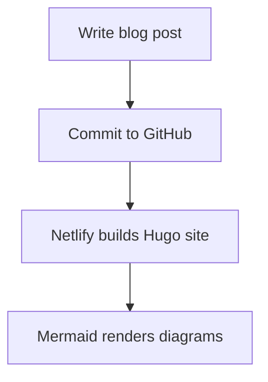

+++
title = "Testing Nutshell and Mermaid js"
author = "Abhit"
date = 2015-01-16
categories = ["test"]
+++

Using [Nutshell](https://github.com/ncase/nutshell) isn’t just about adding scripts.  
It’s about **making explanations expandable** so readers can dive deeper when they want.  
[:What is Nutshell?](#WhatIsNutshell)
<!--more--> 

## Main Features

1. Create expandable explanations  
2. Link to sections on the same page  
3. Embed content from other pages  
[:More on Linking](#LinkingWithNutshell)

Here’s a simple flowchart made with Mermaid:

# Hidden Explanations (at the bottom)

## What Is Nutshell?

Nutshell lets you hide extra content and reveal it only when a reader clicks.  
It keeps articles clean, while still offering more depth for curious readers.  
This makes blogs **interactive and reader-friendly**.

## Linking With Nutshell

You can link to any heading with a colon `:like this`.  
Links can reveal details from the same page or even another site.  
This turns **simple links into expandable explanations**.

